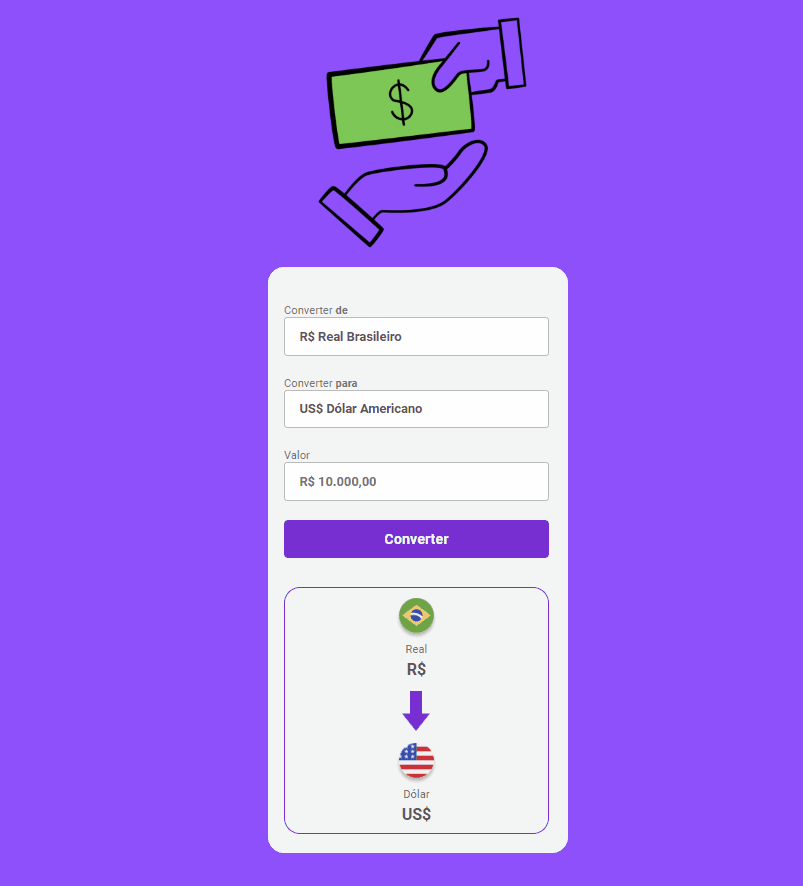

<h1 align="center"> :pager: Money Converter </h1>
 

 Projeto de um conversor online de moedas. De Real para Dólar :dollar: /Euro :euro:. 

 

 
  

<h2>:wrench: Tecnologias Utilizadas</h2>

  

  

  

